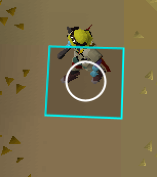

# Visual Tick Pulse

**Tick Pulse** is a visual rhythm metronome. It renders an expanding pulse on your player's tile that resets every game tick.

## Features
- **Visual Metronome:** A smooth, expanding circle that visualizes the duration of a game tick.
- **Rhythm Coloring:** Automatically cycles colors (White -> White -> Red) to help you keep track of 3-tick action cycles.
- **Dynamic Resizing:** The overlay correctly scales when you zoom the camera in or out.

## Configuration
You can customize the plugin in the RuneLite settings panel:
- **Tick colors:** Change the color of Tick 1, 2 and 3 independently.
- **Border:** Toggle the static tile border on/off or change its color.

## How to Use
1. Enable the plugin in RuneLite.
2. The overlay will appear automatically under your character.
3. Use the expansion of the circle to time your clicks.

More **features** coming **soon**!!